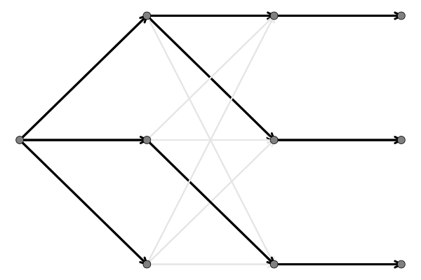
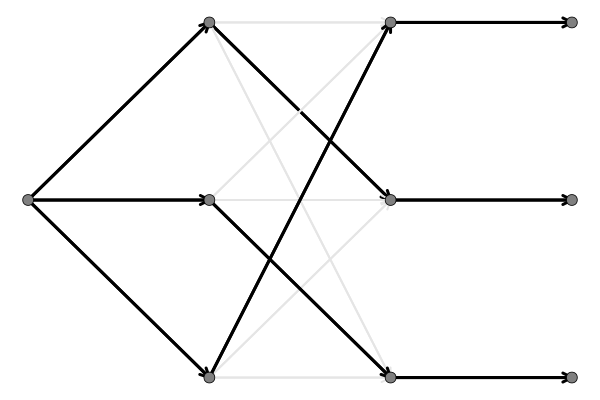

# Problem Set 3 (PS3): Modified Bellman-Ford Algorithm for Single-Source Shortest Paths with Node Capacities
This problem set will continue our discussion of [the Bellman-Ford algorithm](https://en.wikipedia.org/wiki/Bellman–Ford_algorithm) for finding the shortest path from a single source vertex to all other vertices in a weighted graph. 

Problem set 3 is an extension of `Lab-6d` in which we introduce node capacity constraints. The [Bellman-Ford algorithm](https://en.wikipedia.org/wiki/Bellman–Ford_algorithm) is a graph search algorithm that can search graphs with negative edge weights. However, it is slower than Dijkstra's algorithm. Bellman-Ford has a time complexity of $\mathcal{O}(|\mathcal{V}|\cdot|\mathcal{E}|)$, where $|\mathcal{V}|$ is the number of vertices and $|\mathcal{E}|$ is the number of edges in the graph.

## Problem: Update your Bellman-Ford to consider Node Capacities
Updated [your initial Bellman-Ford algorithm](https://en.wikipedia.org/wiki/Bellman–Ford_algorithm) implementation from `Lab-6d` to find the shortest path from a single source vertex to all other vertices in a weighted graph where we consider node capacities.

<div>
    <center>
        
    </center>
</div>

Imagine you (node `1`) are in charge of allocating workers to tasks, i.e., faculty to courses. You have a list of faculty and a list of courses. While each faculty member can teach any course, they have a preference for each course reflected in the edge weight connecting faculty to classes. 
* The weight of the edge connecting faculty `i` to course `j` is the cost of assigning faculty `i` to course `j.` If $w_{ij} < 0$, it means that faculty `i` prefers course `j`. If $w_{ij} > 0$, it means that faculty `i` dislikes course `j`. If $w_{ij} = 0$, it means that faculty `i` is indifferent to course `j.`
* __What are node capacities__?: Each faculty member can be assigned from `0` to a maximum of `N` courses. We capture this idea
by introducing constraints on the in-degree and out-degree of each node in the bipartite graph. These values are stored in the `data/Bipartite.nodecapacity` file. See the comments for an understanding of the file format.

### Helpful Stuff (maybe)
We've updated the `MySimpleDirectedGraphModel` type to include an additional field `A::Array{Float64,2}` which is an $|\mathcal{V}|\times|\mathcal{E}|$ array holding connectivity of the graph, where:

* If $a_{ij} = 0$, node `i` is not connected to edge `j`.
* If $a_{ij} = 1$, node `i` is connected to edge `j`, the edge `j` is an incoming edge for node `i`.
* If $a_{ij} = -1$, node `i` is connected to edge `j`, the edge `j` is an outgoing edge for node `i`.

In addition, we've added the `capacity::Union{Nothing, Tuple{Int64, Int64}}` field to the `MyGraphNodeModel` type to store the node capacities. The first element of the tuple is the in-degree capacity, and the second is the out-degree capacity. You'll need to figure out how to use this information (and how to set this data on each node model) to update the Bellman-Ford algorithm to respect the node capacities.

Finally, we've added the `flow(graph::T, distances::Dict{Int64, Float64}, previous::Dict{Int64, Union{Nothing, Int64}})` method to the `src/Compute.jl` file. This method computes the flow vector $\mathbf{f}$ of the graph given the distances and previous nodes. You may find this method helpful when implementing the modified Bellman-Ford algorithm.
* if $f_{i}\in\mathbf{f}$ is positive, it means that edge $i$ is traversed in the forward direction.
* if $f_{i}\in\mathbf{f}$ is negative, it means that edge $i$ is traversed in the backward direction (not used in this problem).
* if $f_{i}\in\mathbf{f}$ is zero, it means that edge $i$ is not traversed.

### Tasks
1. Implement the `readnodecapacityfile(filepath::String; comment::Char='#', 
    delim::Char=',')::Dict{Int64, Tuple{Int64, Int64}}` function to read the node capacities from the file. This method is in the `src/Files.jl` file. The function takes a path to the capacity file and returns a dictionary where the key is the node ID, and the value is a tuple of the in-degree and out-degree capacities.
2. `Implement` the `_search(graph::T, start::MyGraphNodeModel, algorithm::ModifiedBellmanFordAlgorithm)` method in the `src/Search.jl` file to consider node capacities. This method is similar to the `_search(graph::T, start::MyGraphNodeModel, algorithm::BellmanFordAlgorithm)` method in Lab-6d, but it takes the `ModifiedBellmanFordAlgorithm` as an argument and should produce output that respects the capacity constraints.
3. In addition to updating the functions mentioned above, you can also update or introduce any other functions or types as needed to implement the modified Bellman-Ford algorithm.

## Test your modified Bellman-Ford implementation
In this task, we'll test your modified implementation of [the Bellman-Ford algorithm](https://en.wikipedia.org/wiki/Bellman–Ford_algorithm) using the bipartite graph in the `data/Bipartite.edgelist` file. 

### Incorrect assignment (original Bellman-Ford)
If you execute the `runme_balanced_bellmanford.jl` script (which executes the original Bellman-Ford implementation):

```julia
include("runme_balanced_bellmanford.jl")
```

you should see the following (incorrect) output (stored in the `results` folder):

<div>
    <center>
        
    </center>
</div>

This output is incorrect because the solution violates the node capacity constraints.

### Correct assignment (modified Bellman-Ford)
However, if you implement the `readnodecapacityfile` and `_search` methods correctly, you should see (something like) the following (correct) output (stored in the `results` folder) following the execution of the `runme_balanced_mod_bellmanford.jl` script:

```julia
include("runme_balanced_mod_bellmanford.jl")
```

<div>
    <center>
        
    </center>
</div>

In this case (given the same input), the assignments produced by the modified algorithm respect the node capacity constraints.

## Assessment
This is a `fun problem` because it may not be possible to assign faculty to courses while respecting the node capacities using Bellman-Ford. Later, we'll solve this problem using linear programming, but now, let's celebrate the end of the beginning of the semester.
* Thus, if you do something that runs and at least produces the original output, you'll get full credit. 
* If you implement the modified algorithm and produce the correct output, you'll get a superpower: the ability to drop one of your lowest problem set scores.

Let's have some fun!